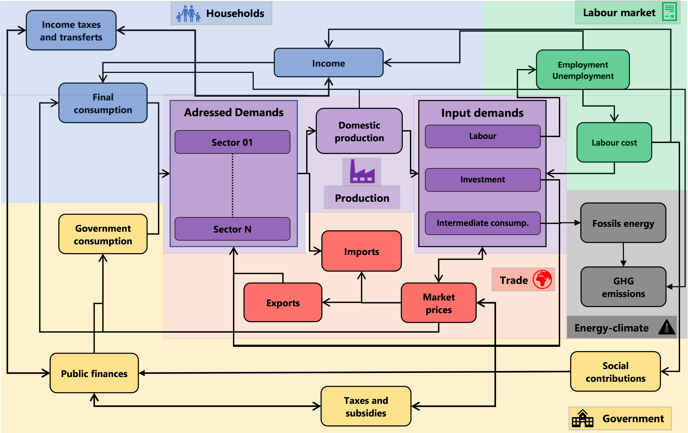
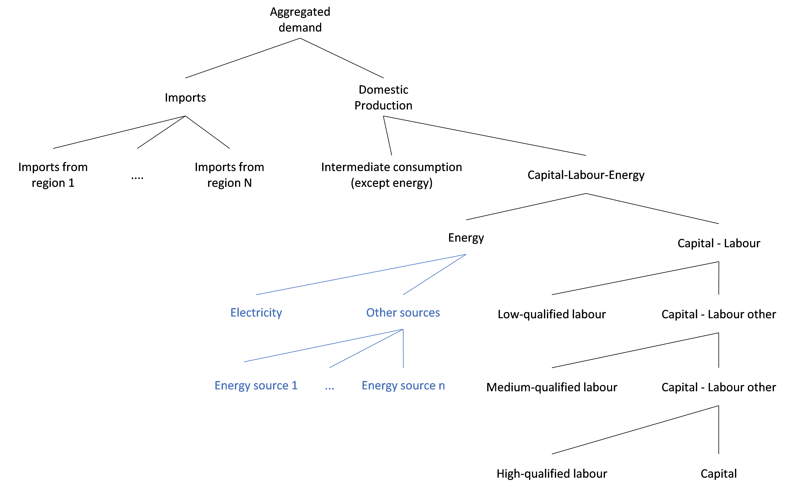
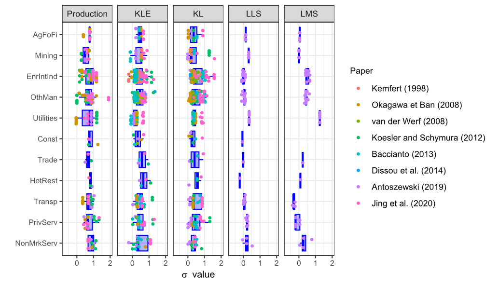

# 3. Detailed model features

## 3.1 General structure

The model is structured around several interconnected blocks (Figure below).

It starts with **households**, whose income—composed of labour and capital earnings and adjusted for taxes and transfers from or to the government—determines both the level and composition of final consumption.
On the other side, the **government** collects taxes and provides support to households and firms through social benefits and subsidies. The government also directly demands products and services from various economic sectors.
Household and government final consumption, combined with intermediate consumption and investment goods demanded by other economic sectors, constitute the domestic **demand addressed** to domestic firms. Adding exports leads to the total demand faced by the domestic economy.
In response to this total demand, domestic firms decide whether to meet it through **domestic production or imports**. In the case of imports, the product or service imported from one region corresponds to the exports of the supplying region.
For the portion of demand covered by domestic production, the **production** process requires intermediate consumption from other sectors, capital (or investments accounting for net of installed capital and obsolescence), and labour. All **production factors** are remunerated at market prices: intermediate and investment goods are paid at production prices plus margins, while labour is paid through wages.
Wage formation depends on the **labour** demand from firms, differentiated by qualification levels, and on the labour supply, which results from the population structure in terms of age and education, but also on the tension on the labour market, proxied by the unemployment rate by educational level. Labour supply is exogenous in the model.
Domestic production of goods and services requires, among other inputs, energy—part of which comes **from fossil fuel sources**. The use of fossil energy leads to **GHG emissions** into the atmosphere. Household consumption, particularly for heating, cooling, and private transportation, also involves fossil energy use and therefore contributes to GHG emissions. Additionally, some specific production processes directly generate GHG emissions into the air.

## 3.2 Supply side

On the supply side, each sector in each region is faced with total demand, which is composed of households’ and government’s final consumption, as well as demand from other firms for intermediate consumption and investment goods and finally of the demand outside the region, i.e., exports.

In the first step, sectors decide—via Armington functions—whether to meet this demand through imports or domestic production, based on relative prices and preferences for domestic products or services (see section on [Trade](#4.4-International-trade))
Once the level of domestic production is determined, the sector gradually defines the quantity of production factors to mobilise. The production process is modelled using nested CES production functions (see equations below).
At the first level, the choice is between intermediate consumption (excluding energy) and a combined capital-labour-energy bundle. In the second step, energy is separated from this bundle. The energy demand is then split into electricity and other energy sources, and finally into specific energy types within the non-electricity category.
On the capital-labour side, the next three stages separate labour demand by qualification level: first low-skilled workers, then medium-skilled, and finally high-skilled workers.

:math:`Bdl_i = \propto_{Bld_i} \cdot (Bdl_{up} \cdot TPBdl_{up}) \cdot \beta_{Bld_i} \cdot (P_{Bdl_i} \cdot TPBdl_i)^{-\sigma_{Bdl_{up}}} \cdot \left( \sum_{i}^{N} \beta_{Bld_i} (P_{Bdl_i} \cdot TPBdl_i)^{1 - \sigma_{Bdl_{up}}} \right)^{\frac{\sigma_{Bdl_{up}}}{1 - \sigma_{Bdl_{up}}}}`

$$ Bdl_i = \propto_{Bld_i} \cdot (Bdl_{up} \cdot TPBdl_{up}) \cdot \beta_{Bld_i} \cdot (P_{Bdl_i} \cdot TPBdl_i)^{-\sigma_{Bdl_{up}}} \cdot \left( \sum_{i}^{N} \beta_{Bld_i} (P_{Bdl_i} \cdot TPBdl_i)^{1 - \sigma_{Bdl_{up}}} \right)^{\frac{\sigma_{Bdl_{up}}}{1 - \sigma_{Bdl_{up}}}} $$

$$
PBdl_{up}
= \propto_{\text{PBld}_{up}}
\cdot
\left(
\sum_{i}^{N} 
\beta_{\text{Bld}_i} 
\left( P_{\text{Bdl}_i} \cdot \text{TPBdl}_i \right)^{1 - \sigma_{\text{Bdl}_{up}}}
\right)^{\frac{1}{1 - \sigma_{\text{Bdl}_{up}}}}
$$

With $Bdl_i$, the $i^{th}$ element of the bundle of the $N$ elements in $Bdl_{up}$, the upper element of the bundle, $TPBdl_i$, the efficiency factor of the $i^{th}$ bundle, $P_{Bdl_i}$, the price of the $i^{th}$ bundle, the efficiency factor of the bundle $i$, $\beta_{Bld_i}$, the cost share of the $i^{th}$ bundle, $\propto_{Bld_i}$, a scale parameter, and $\sigma_{Bdl_{up}}$, the substitution elasticity.

In this supply-side framework, the substitution parameters of the CES functions are key to determining how the supply block responds to price shocks. Since the data used in the model are not time-series, we cannot estimate these parameters directly by sector or region.
Therefore, we conducted a literature review of existing estimates of CES substitution elasticities across different industries. The following figure summarises the main findings. Based on this review, we retained the average elasticity values for each aggregated sector.

*Source: [Kemfert, 1998](https://doi.org/10.1016/s0140-9883(97)00014-5); [Okagawa et al., 2008](https://www.researchgate.net/publication/5206877_Estimation_of_Substitution_Elasticities_for_CGE_Models); [Van Der Werf, 2007](https://doi.org/10.2139/ssrn.983034); [Koesler et Schymura, 2015](https://doi.org/10.1080/09535314.2014.926266); [Baccianti, 2013](https://doi.org/10.2139/ssrn.2353824); [Dissou et al., 2015](https://doi.org/10.1007/s11293-014-9443-1); [Antoszewski, 2019](https://doi.org/10.1016/j.eneco.2019.07.016); [Cao et al., 2020](https://doi.org/10.1016/j.eneco.2020.104958)*
*Naming convention: AgFoFi: Agriculture, Forestry and Fishery, Mining: Mining and Quarrying, EnrIntInd: Energy intensive Industry, OthMan: Other manufactures, Utilities: Utilities, Const: Construction, Trade: Trade, Hotrest: Hotels and Restaurants, Transp; Transports, PrivServ: Market services; NonMarkServ: Non-Market services. Bundles: KLE: Capital-Labour-Energy; KL: Capital-Labour; LLS: Low-skilled-other labour; LMS; medium skill-other labour*

## 3.3 Households' consumption

### 3.3.1 Aggregated consumption

The trade-off between consumption and savings depends on the real disposable income, the aggregated household consumption price index, the unemployment rate, and the population structure—particularly the shares of young individuals (under 15) and older individuals (over 65).
This relationship is modelled using an Error Correction Model (ECM) following [Engle and Granger (1987)](), which captures both short-term and long-term dynamics. Shocks can have different impacts in the short run versus the long run, but over time, all shocks tend to converge towards the long-term relationship.

The long-term relationship is specified as follows:
$$
\ln(c) 
= \beta_r 
+ \beta_{rev} \cdot \ln(rev) 
+ \beta_{yg} \cdot Sh_{young} 
+ \beta_{old} \cdot Sh_{old} 
+ \beta_{infl} \cdot \ln(infl) 
+ \beta_U \cdot U 
+ \beta_{popact} \cdot Sh_{popact}
$$

The short-term dynamic is specified as:
$$
d\ln(c) 
= \alpha_r 
+ \alpha_{rev} \cdot d\ln(rev) 
+ \alpha_{yg} \cdot dSh_{young} 
+ \alpha_{old} \cdot dSh_{old} 
+ \alpha_{infl} \cdot d\ln(infl) 
+ \alpha_U \cdot dU 
+ \alpha_{popact} \cdot dSh_{popact} 
+ \alpha_{err\_lt} \cdot error\_lt
$$

Where:  
*   $c$: per capita final household consumption  
*   $rev$: per capita household disposable income  
*   $Sh_{young}$: share of the population younger than 15  
*   $Sh_{old}$: share of the population older than 65  
*   $Sh_{popact}$: share of the active population  
*   $infl$: inflation  
*   $U$: unemployment rate  
*   $error_{lt}$: the estimation errors of the long-term relationship

In the long-term equation, the consumption per capita is a positive function of the households’ disposable income (with a unitary indexation in the long-term), a negative function of consumption prices and of unemployment rate that proxies the uncertainty of the current domestic  economic context, the share of young, old and active population may also influence positively or negatively the households consumption.
These relationships have been estimated for a sample of countries (China, USA, UK, Germany, France, Spain, Italy, Japan, Canada, South Korea, Brazil, Russia, Australia, Mexico, India, and Indonesia) and years (from 2000 to 2022), based on data drawing from [OECD (2024)](https://www.oecd.org/en/data/datasets/inter-country-input-output-tables.html).

### 3.3.2 Consumption allocation by purpose

Once total household consumption expenditure is determined, households allocate their consumption across different products and services. This allocation is modelled using a nested CES function. 

**: Trade is modelled as a fixed share of households’ consumption of products*

At the first level, aggregate final consumption is divided into four main nodes: “*Basics*”, “*Transportation*”, “*Trade*”, and other goods and services (referred to as "*Rest*"). Trade is modelled as a fixed share of certain consumption products, assuming a constant average margin rate.
The “*Basics*” bundle is further disaggregated into three sub-nodes: “*Essentials*”, “*Housing*”, and “*Heating and Cooling*”. These are subsequently split into:
*   Essentials: “Food” and “*Clothing*”.
*   Housing: “*Rent*” and “*Water and Waste*”.
*   Heating and Cooling: different types of fuels.
On the “*Transportation*” side, the next level distinguishes between “*Private Cars*”, “*Other Inland Transport*”, “*Air Transport*”, “*Water Transport*” and “*Other Transport*”. “*Private Cars*” are then split into “*Internal Combustion Engine Vehicles*”, “*Plug-in Hybrid Electric Vehicles*”, and “*Battery Electric Vehicles*”, each of which is further divided into vehicle purchase and the respective fuel consumption.
For the “*Rest*” category (i.e., the remaining goods and services not yet allocated), the next step distinguishes between “*Non-Market Services*” and a residual “*Rest*” node. “*Non-Market Services*” are then broken down into “*Education*”, “*Health*”, and “*Other Non-Market Services*”. The “*Rest*” bundle is split into “*Leisure*”, “*Equipment*”, and a residual “*Rest*” category. Finally, “*Leisure*” is further disaggregated into “*Hotels and Restaurants*”, “*Information and Communication*”, and “*Other Leisure*” services.
All final nodes in the consumption tree are linked to the corresponding economic sectors, representing the demand addressed by households to each sector.
$$
Cons_{node_i} 
= \propto_{node_i} \cdot Cons_{node_{up}} 
\cdot \left( \frac{P_{node_{up}}}{P_{node_i}} \right)^{\sigma_{node_{up}}}
$$
$$
P_{node_{up}} 
= \propto_{P_{node_i}} \cdot 
\left( \sum_{i}^{N} \beta_{Cons_{node_i}} \cdot P_{node_i}^{\sigma_{node_{up}}} \right)^{\frac{1}{1-\sigma_{node_{up}}}}
$$

Where:  
*   $Cons_{node_i}$: the consumption demand for the node $i$  
*   $P_{node_{up}}$: the price of this upper node  
*   $Cons_{node_{up}}$: the consumption demand for the upper node  
*   $P_{node_{up}}$: its price  
*   $\beta_{Cons_{node_i}}$: the share of the consumption demand in the node  
*   $\propto_{P_{node_i}}$: scale parameters  
*   $\sigma_{node_{up}}$: the substitution elasticity  

The substitution elasticities in the nested CES household consumption function range between 0.3 and 1. A dedicated survey was conducted to collect data enabling the differentiation of these elasticities across the nesting levels. However, the results proved to be neither consistent nor sufficiently robust. Consequently, we adopted conventional values commonly used in large-scale models (e.g., GTAP). These estimates can be revised once more reliable data become available.

## 3.4 International trade

International trade is integrated in the nested CES production functions, following the Armington approach ([Armington, 1969](https://doi.org/10.2307/3866403)). Trade at the sectoral level is represented in two steps. First, the representative firms in each sector decide how to satisfy demand, choosing between domestic production and imports. The Armington framework allows for a combination of both options (see equations below).
$$
DOMQ = \propto_{DOMQ} \cdot ADDDTOTQ \cdot \beta_{DMOQ} \cdot \left( \frac{PPROD}{PADDDTOT} \right)^{-\sigma_{imp}}
$$
$$
IMPQ = \propto_{IMPQ} \cdot ADDDTOTQ \cdot \beta_{IMPQ} \cdot \left( \frac{PIMP}{PADDDTOT} \right)^{-\sigma_{imp}}
$$

Where:  
*   $DOMQ$: the domestically satisfied demand  
*   $IMPQ$: the imports  
*   $ADDDTOTQ$: the total demand addressed  
*   $PPROD$: the domestic production price  
*   $PIMP$: the price of imports  
*   $PADDDTOT$: the price of the internal demand  
*   $\propto$: scale parameters  
*   $\beta_x$: the share of the demand $X$ in the bundle  
*   $\sigma_{imp}$: the substitution elasticity

In the second step, the total volume of imports required to satisfy sectoral demand is allocated across different regions based on relative prices (see equations 9 and 10). Since imports are modelled bilaterally, the exports of one region correspond to the imports of another. The substitution elasticity values for the first level of the CES function ranges between 2.5 and 3.1 and are based on ([Bajzik et al., 2020](https://doi.org/10.1016/j.jinteco.2020.103383)) and those of the second level range between 0.5 and 3.8 ([Donnelly et al., 2004](https://www.usitc.gov/publications/332/ec200401a.pdf)).

$$
PIMP = \propto_{PIMP} \cdot 
\left( \sum_{r \neq d}^{R} \beta_{IMPQ_{bilat}}^r \left( PIMP_{bilat}^r \cdot iceb^r \right)^{1-\sigma_{bilat}} \right)
$$
$$
IMPQ_{bilat}^r = \propto_{IMPQ_{bilat}} \cdot IMPQ \cdot  \beta_{IMPQ_{bilat}}^r 
\cdot \left( \frac{PIMP_{bilat}^r \cdot iceb^r}{PIMP} \right)^{-\sigma_{bilat}}
$$

Where:  
*   $PIMP$: the price of import in region $d$  
*   $PIMP_{bilat}$: the import prices of the product coming from region $r$ (i.e., the export price for the country $r$ including import taxes)  
*   $IMPQ_{bilat}^r$: the import of the region $d$ from region $r$  
*   $iceb^r$: the “iceberg cost” ([Krugman, 1991](https://doi.org/10.1086/261763))  
*   $\propto_{PIMP}$: a scale parameter  
*   $\beta_{IMPQ_{bilat}}^r$: the share of imports from region $r$ in the overall imports  

The iceberg costs are calculated as coefficients ranging between 1 and 2 and scaled with the distance between the capital of each region.

## 3.5 Labour market

While labour demand is derived from the optimisation behaviour inherent in the firms’ use of the production functions (see section [3.2](#32-supply-side)), labour supply is based on population projections by qualification level (educational attainment) and age. In the current version of the model, the projection of the qualification is based on [KC et al. (2024)](), and in particular the one for SSP2. The interaction of labour demand and supply is specified in the model by wage curves. These wage curves determine the wage rates by linking the rate of growth of wages to unemployment level, labour productivity (to ensure long term stability of profits/total wages ratio) and consumption prices (equation below). Wage equations are different for low-, medium- and high-qualified labour, essentially constituting three different labour markets.

$$
Av = \propto_{av} \cdot 
\left( \frac{PRODQ}{DEMPTOT} \right)^{\theta_{pty}}
\cdot PCONS^{\theta_{pons}}
\cdot PCONS_{-1}^{\theta_{pcons_{-1}}}
\cdot e^{\theta_{un} \cdot \left( UNEMPRA - UNEMPRA^{LT} \right)}
$$

Where:  
*   $Av$: the average annual earnings by workers  
*   $PRODQ$: the production  
*   $DEMPTOT$: the total employment  
*   $PCONS$: the consumption price at time $t$  
*   $PCONS_{-1}$: the consumption price at time $t-1$  
*   $UNEMPRA$: the unemployment rate  
*   $UNEMPRA^{LT}$: the natural unemployment rate (long-term unemployment rate that does not accelerate inflation)  
*   $\propto_{av}$: a scale parameter  
*   $\theta_{pty}$: the productivity parameter (set to 0.66, proxying the share of labour in GDP)  
*   $\theta_{pons}$ and $\theta_{pcons_{-1}}$: indexation parameters of wages on consumption prices (both set to 0.5)  
*   $\theta_{un}$: the unemployment parameter (set to −1.5)

## 3.6 Energy and climate module

The supply and consumption blocks, through the CES embodied production (section [3.2](#32-supply-side)) and the consumption by purpose functions (section [3.3](#33-households-consumption)), define the energy demand by product. These product-specific energy demands are then allocated to their corresponding supplying sectors.
The main feature of the energy module lies in modelling the power generation sector. In this sector, 17 distinct technologies are specified (see Table below for an indicative example of the “Rest of EU” region) each characterized by different parameters: investment costs, fixed and variable operation and maintenance costs, fuel costs, and CO₂ emission costs. These parameters are used to calculate the levelized cost of electricity (LCOE) for each technology. The resulting LCOEs are then introduced into a logistic function, which determines the share of each technology in the overall power generation mix (equation below).

$$
Prodp_{tech}
=
\left[
\propto_{tech}\,
Prodp_{res}\,
\left(
\frac{LCOE_{tech}}{LCOE_{Tot}}
\right)^{\left(\emptyset_{tech}+
\partial_{tech}\, e^{\mu_{tech}\,Sh_{tech-1}}
\right)}
\right]
\cdot
AJ_{elec}
$$

With:  
*   $Prodp_{tech}$: the production of electricity with the technology $tech$  
*   $Prodp_{res}$: electricity production from technologies whose deployment is not constrained. In some scenarios, certain technologies are assumed to follow pre-defined (non-flexible) deployment pathways—nuclear power, for example, whose expansion is often governed by political decisions and national regulatory limits rather than purely economic considerations.  
*   $LCOE_{tech}$: the levelized cost of the technology  
*   $LCOE_{Tot}$: the levelized cost of all technologies (weighted with the power mix of previous period)  
*   $Sh_{tech-1}$: the share of the technology in the power generation mix of the previous period  
*   $AJ_{elec}$: an adjustment variable ensuring that the sum of all production means equals total demand  
*   $\propto_{tech}$: scale parameters  
*   $\emptyset_{tech}$, $\partial_{tech}$, and $\mu_{tech}$: parameters of the logistic functions

| Technology           | Overnight investments cost (€2019/kW) | Fixed O&M cost (€2019/kW) | Variable O&M cost (€2019/MWh) | Effective capacity factor (%) | Technical capacity factor (%) | Net conversion efficiency (%) | Lifetime (years) | Construction time (years) |
|---------------------|--------------------------------------|----------------------------|-------------------------------|-------------------------------|-------------------------------|------------------------------|-----------------|---------------------------|
| Nuclear             | 3,853                                | 122                        | 7.9                           | 0.75                          | 0.85                          | 0.38                         | 50              | 8.0                       |
| Coal                | 1,511                                | 38                         | 3.7                           | 0.60                          | 0.80                          | 0.46                         | 40              | 3.0                       |
| Coal (CCUS)*        | 3,629                                | 69                         | 6.4                           | 0.50                          | 0.80                          | 0.29                         | 40              | 5.0                       |
| Gas                 | 755                                  | 21                         | 2.5                           | 0.35                          | 0.35                          | 0.57                         | 30              | 3.0                       |
| Gas (CCUS)*         | 1,931                                | 45                         | 3.5                           | 0.30                          | 0.80                          | 0.46                         | 30              | 5.0                       |
| Oil                 | 1,273                                | 22                         | 2.9                           | 0.40                          | 0.40                          | 0.35                         | 40              | 1.0                       |
| Biomass (wastes)    | 2,136                                | 47                         | 0.9                           | 0.60                          | 0.10                          | 0.34                         | 20              | 3.0                       |
| Biomass (biogas)    | 1,208                                | 26                         | 2.7                           | 0.60                          | 0.20                          | 0.38                         | 25              | 2.0                       |
| Biomass             | 2,069                                | 43                         | 3.8                           | 0.60                          | 0.80                          | 0.50                         | 40              | 3.0                       |
| Biomass (CCUS)*     | 3,820                                | 24                         | 2.9                           | 0.50                          | 0.70                          | 0.43                         | 30              | 5.0                       |
| Hydro               | 3,183                                | 27                         | 0.3                           | 0.50                          | 1.00                          | 1.00                         | 60              | 8.0                       |
| Geothermal          | 4,743                                | 101                        | 0.3                           | 0.45                          | 0.45                          | 0.30                         | 30              | 4.0                       |
| Solar PV            | 363                                  | 13                         | 0.0                           | 0.17                          | 0.17                          | 1.00                         | 20              | 1.5                       |
| CSP                 | 4,032                                | 105                        | 0.1                           | 0.26                          | 0.26                          | 0.33                         | 25              | 2.5                       |
| Wind Onshore        | 1,171                                | 19                         | 0.5                           | 0.26                          | 0.26                          | 1.00                         | 25              | 1.5                       |
| Wind Offshore       | 1,722                                | 35                         | 0.5                           | 0.39                          | 0.39                          | 1.00                         | 25              | 2.5                       |
| Tidal               | 5,093                                | 128                        | 0.1                           | 0.27                          | 0.27                          | 1.00                         | 80              | 5.0                       |

Source: Authors calculation based on [IEA (2024)](https://iea.blob.core.windows.net/assets/a2aaddf1-a0f8-4ecb-8b20-31622423bc2e/GlobalEnergyandClimateModelDocumentation2024.pdf), [Mantzos, et al. (2019)](https://data.europa.eu/doi/10.2760/32835) and [UNData (2025a)](https://unstats.un.org/unsd/energystats/).
*NB: values differ overtime (except lifetime and construction time) and according to region.*
**: CCS technologies are not available on production before 2035 in the model*

For GHG emissions, we distinguish four different gases (CO2, CH4, N2O and F-gases) and 6 different emissions sectors: fuels combustion, fugitive emissions, industrial processes, agriculture, wastes and land use (this later is exogeneous). Emissions from fuel combustion and fugitive emissions are modelled based on emissions factors for each fossil fuel (solid fuel, oil and natural gas) and each gas (CO2, CH4 and N2O) whereas GHG emissions from industrial processes, agriculture and wastes are a function of the production of the emitting economic activities. For the later, exogenous efficiency trends can be added as well as abatement factors according to emissions price.

$$
{EM}_F = \propto_{EM} \cdot \left[ \sum_{FF} FF \cdot {emgas}_{FF} \right]
$$
$$
{EM}_O = \propto_{EM} \cdot PRODQ \cdot {TPT}_{EM} \cdot {FACTABT}_{EM\_O}
$$
$$
{FACTABT}_{{EM}_O} = \frac{\emptyset_{EM}}{\partial_{EM} \cdot \left( \delta_{EM} \cdot {TAX}_{EM} \right)^{\theta_{EM}}}
$$

With:  
*   $\text{EM}_F$, the emissions from fuel combustion or fugitive emissions  
*   $FF$, the quantity of fossil fuels in physical units  
*   $\text{emgas}_{FF}$, the emission factor depending on the gas and the fossil fuel  
*   $\propto_{EM}$, a scale parameter

And:
*   $\text{EM}_O$, emissions from industrial processes, agriculture and wastes  
*   $PRODQ$, the production of the emitting economic activity  
*   $\text{TPT}_{EM}$, the efficiency factor  
*   $\text{FACTABT}_{{EM}_O}$, the abatement factor  
*   $TAX_{EM}$, the tax on the emissions  
*   $\emptyset_{EM}$, $\partial_{EM}$, $\delta_{EM}$, $\theta_{EM}$, parameters for the abatement curves

