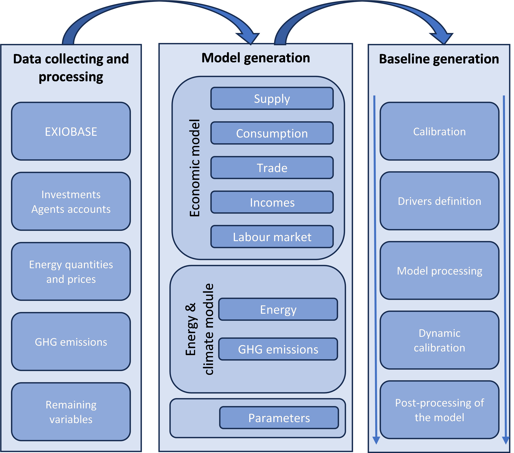

# 4. Model manuel

## 4.1 Software

Table below summarises the required software to run the different step of the model. Before the simulations, the model requires Windows OS (Windows 11 recommended), with a minimum 8 Gb of RAM (recommended) and 20Gb storage (recommended).

| Data collecting | Data processing | Model simulation |
|-----------------|----------------|----------------|
| Python 3.12.10 including the following package: pymrio v0.5.4 | Python 3.12.10 including the following packages: pymrio 0.5.4, Pandas 2.2.3, Numpy 2.2.6, Iode 1.0.4 | Python 3.12.10 including the following packages: pymrio 0.5.4, Pandas 2.2.3, Numpy 2.2.6, Iode 1.0.4 |
| Jupyter Notebook | Jupyter Notebook | Iode GUI v1.0.4 |
|                 |                 | Jupyter Notebook |
|                 |                 | Microsoft Excel or equivalent Workbook |

## 4.2 Model and baseline generation

Once the required software is properly installed, the process begins with the collection and processing of the EXIOBASE database. This step gathers and processes a large share of the necessary economic variables for the reference year—here, 2019. In addition, pre-processed files are used to calculate gross fixed capital formation by region and sector, as well as the flow of income for households and governments by region, ensuring consistency with the information available in EXIOBASE. Subsequently, data on energy quantities and prices are loaded, processed and used to complete the calculation of certain economic variables. Similarly, GHG emissions are loaded and allocated to economic activities and households in proportion to their fossil energy consumption or, for industrial process emissions, according to their production levels. A set of remaining variables (e.g., unemployment, population, interest rates) are then gathered and used to complete and finalise the database of the model. A current version of the database is already uploaded in the models’ GitHub page; however, this stage is necessary for users intending to make changes and adaptations to the underlying data and assumptions.

When the core database is created, the next step is the creation of the equations, which is done block by block, as well as the calculation of necessary variables from the core database. The equations can be separated by blocks: the economic model that includes the supply/production side, households’ consumption, international trade, income flows for households and governments, and the labour market. Concerning the energy and climate module, equations are grouped in two main blocks: i) energy quantities in physical and monetary units and prices; and ii) the GHG emissions block. As a final step, a set of parameters is loaded—i.e., those related to behavioural equations—while others are directly calculated based on raw data to finalise the model generation.

The next step consists of generating the baseline scenario. First, all variables are extrapolated over the simulation period, assuming that values remain constant, while some key equations are inversed to allow calibration over time. Thus, this calibration process ensures the stability of the model and allows performing tests capturing the main properties and behaviour of the model.

Running a baseline (or reference) scenario is based on a set of predefined options. At minimum, this requires quantifying the exogenous variables, as defined for the reference scenario: population (by age and qualification level), interest rates, and fossil fuel prices.
Usually, a baseline for the economic development path is also defined—including GDP growth, inflation, and the long-term unemployment rate—which are typically endogenous outputs of the model. To align model outputs with this predefined economic path, calibration parameters in key equations are adjusted (shocked). The choice of which equations to adjust depends on both the outputs that need to match projections and the requirement to maintain the model's internal consistency. For example, targeted GDP growth is achieved through its components: household private consumption, government final consumption, gross fixed capital formation, imports, and exports. Specifically, for gross fixed capital formation, the calibration parameters of investment demand in each sector are iteratively adjusted to align with the total economy’s investment target, which, in the long run, must converge to a fixed share of GDP. Similar adjustments are made for private consumption, while ensuring consistency between wages and income.

