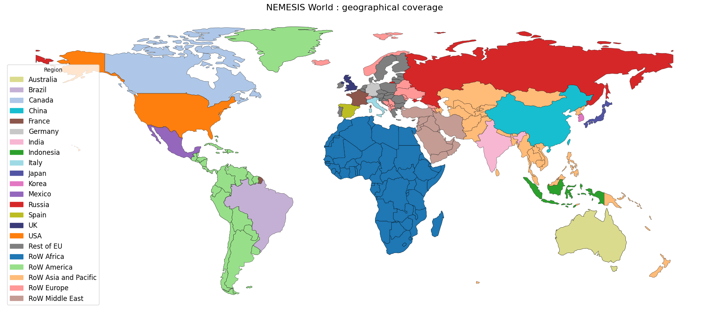

# 1. Model Overview

## 1.1 Note of version

The version presented here corresponds to the first final version (v1.0.0) of the model including the economic core as well as the energy module. 

## 1.2 Geographical coverage

The geographical coverage of the NEMESIS-World model includes 22 different regions, 16 of which represent countries that form the largest economies of the World. In 2022, those 16 countries represented 75% of the World GDP, 55% of the population [International Monetary Fund (2025)](https://www.imf.org/en/publications/weo/issues/2025/04/22/world-economic-outlook-april-2025) and 70% of global GHG emissions [Crippa, M. et al. (2024)](https://data.europa.eu/doi/10.2760/4002897). The remaining regions are grouped in 6 different geographical zones. Such regional detail, covering major economies, is important when assessing decarbonisation policies that are mostly country or region-specific whereas, six different geographical area for the non-disaggregated countries allows the model to be able to map with general IPCC standardised reporting regions. The 22 regions covered are:
*   Africa: all African countries (named **RoW Africa, WF**)
*   America: **Canada (CA)**, **Brazil (BR)**, **Mexico (MX)**, **United States of America (US)** and the rest of American countries (**RoW America, WL**)
*   Asia and Pacific: **Australia (AU)**, **China (CN)**, **South Korea (KR)**, **India (IN)**, **Indonesia (ID)**, **Japan (JP)**, **Russia (RU)**, the rest of Asian and Pacific countries (**RoW Asia & Pacific, WA**) and the Middle East countries (**RoW Middle East, WM**)
*   Europe: **France (FR)**, **Germany (DE)**, **Italy (IT)**, **Spain (ES)**, **the United Kingdom (UK)**, the Rest of European Union Member States (**Rest of EU, OE**) and the rest of European Countries (**RoW Europe, WE**)

| Région            | Pays / Code                 | Liste des pays |
|-------------------|-----------------------------|-----------------|
| Africa            | RoW Africa (WF)             | Algeria, Angola, Benin, Botswana, Burkina Faso, Burundi, Cabo Verde, Cameroon, Central African Republic, Chad, Comoros, Congo, Côte d’Ivoire, Djibouti, Egypt, Equatorial Guinea, Eritrea, Eswatini, Ethiopia, Gabon, Gambia, Ghana, Guinea, Guinea-Bissau, Kenya, Lesotho, Liberia, Libya, Madagascar, Malawi, Mali, Mauritania, Mauritius, Morocco, Mozambique, Namibia, Niger, Nigeria, Rwanda, Sao Tome and Principe, Senegal, Seychelles, Sierra Leone, Somalia, South Africa, South Sudan, Sudan, Tanzania, Togo, Tunisia, Uganda, Zambia, Zimbabwe, Western Sahara |
| America           | Canada (CA)                 | Canada |
|                   | Brazil (BR)                 | Brazil |
|                   | Mexico (MX)                 | Mexico |
|                   | USA (US)                    | United States of America |
|                   | RoW America (WL)            | Argentina, Chile, Haiti, Dominican Rep., Bahamas, Falkland Is., Greenland, Uruguay, Bolivia, Peru, Colombia, Panama, Costa Rica, Nicaragua, Honduras, El Salvador, Guatemala, Belize, Venezuela, Guyana, Suriname, Ecuador, Puerto Rico, Jamaica, Cuba, Paraguay, Trinidad and Tobago, Antigua and Barbuda, Barbados, Dominica, Grenada, Saint Kitts and Nevis, Saint Lucia, Saint Vincent and the Grenadines |
| Asia & Pacific    | Australia (AU)              | Australia |
|                   | China (CN)                  | China |
|                   | India (IN)                  | India |
|                   | Indonesia (ID)              | Indonesia |
|                   | Japan (JP)                  | Japan |
|                   | South Korea (KR)            | South Korea |
|                   | Russia (RU)                 | Russia |
|                   | RoW Asia & Pacific (WA)     | Kazakhstan, Uzbekistan, Turkmenistan, Kyrgyzstan, Tajikistan, Afghanistan, Bangladesh, Bhutan, Nepal, Pakistan, Sri Lanka, Maldives, Timor-Leste, Brunei, Cambodia, Thailand, Laos, Myanmar, Vietnam, Philippines, Malaysia, North Korea, Mongolia, Azerbaijan, Papua New Guinea, Vanuatu, Solomon Is., New Caledonia, New Zealand, Fr. S. Antarctic Lands, Fiji, Tonga, Samoa, Micronesia, Palau, Tuvalu, Kiribati, Nauru, Singapore |
|                   | RoW Middle East (WM)        | Lebanon, Palestine, Jordan, United Arab Emirates, Qatar, Kuwait, Iraq, Oman, Iran, Israel, Syria, Turkey, Yemen, Saudi Arabia, N. Cyprus, Bahrain |
| Europe            | France (FR)                 | France |
|                   | Germany (DE)                | Germany |
|                   | Italy (IT)                  | Italy |
|                   | Spain (ES)                  | Spain |
|                   | The United-Kingdom (UK)     | United-Kingdom |
|                   | Rest of EU (OE)             | Sweden, Poland, Austria, Hungary, Romania, Lithuania, Latvia, Estonia, Bulgaria, Greece, Croatia, Luxembourg, Belgium, Netherlands, Portugal, Ireland, Denmark, Slovenia, Finland, Slovakia, Czechia, Cyprus, Malta |
|                   | RoW Europe (WE)             | Norway, Armenia, Belarus, Ukraine, Moldova, Albania, Switzerland, Iceland, Georgia, Bosnia and Herzegovina, North Macedonia, Serbia, Montenegro, Kosovo, Andorra, Azerbaijan, Liechtenstein, Monaco, San Marino |

## 1.3 Sectoral coverage

The model represents 59 different economic activities for each region modelled. This high level of sectoral detail allows the model to provide detailed economic impact assessments. Particular emphasis has been placed on disaggregating sectors impacting or be impacted by climate change mitigation options. 
The economic activities include the following disaggregated sectors:
*   **Four agricultural sectors**: Agriculture – vegetable; Agriculture – animals; Forestry; and Fishery.
*   **Four mining and quarrying sectors**: Mining of coal; Extraction of oil; Extraction of natural gas; and Other mining.
*   **Thirteen energy intensive industries**: Manufacture of pulp, paper and printing products; Manufacture of coke; Manufacture of petroleum and nuclear products; Chemicals – plastics; Chemicals – fertilisers; Chemicals – others; Manufacture of rubber and plastic products; Manufacture of glass; Manufacture of cement and lime; Manufacture of other non-metallic mineral products; Manufacture of iron and steel; Manufacture of other basic metals and Aluminium production.
*   **Eleven other manufacturing industries**: Manufacture of food, beverage and tobacco; Manufacture of textiles, wearing apparel and leather products; Manufacture of wood and wood products; Manufacture of fabricated metal products; Manufacture of machinery and equipment; Manufacture of office machinery and computers; Manufacture of electrical machinery and apparatus; Manufacture of radio, television and communication equipment and apparatus; Manufacture of medical, precision and optical instruments, watches and clocks; Manufacture of motor vehicles, trailers and semi-trailers; Manufacture of other transport equipment and Other manufacturing.
*   **Eight utilities**: Wastes treatment and recycling; Production of electricity; Transmission of electricity; Distribution and trade of electricity; Manufacture of gas; distribution of gaseous fuels through mains; Steam and hot water supply and Water distribution.
*   **One construction sector**: Construction.
*   **Six transportation related sectors**: Transport via railways; Other land transport; Sea and coastal water transport; Inland water transport; Air transport and Other transport. 
*   **Eight market services**: Trade; Hotels and restaurants; Finance; Insurance; Real estate activities; Information and communication; Research and development; Other business activities.
*   **Four non-market services**: Public administration and defence; compulsory social security; Education; Health and social work and Other services activities.

| Code | Sector |
|------|--------|
| 01 | Agriculture - vegetable |
| 02 | Agriculture - animals |
| 03 | Forestry |
| 04 | Fishery |
| 05 | Mining of coal |
| 06 | Extraction of oil |
| 07 | Extraction of natural gas |
| 08 | Other mining |
| 09 | Manufacture of food, beverage and tobacco |
| 10 | Manufacture of textiles, wearing apparel and leather products |
| 11 | Manufacture of wood and wood products |
| 12 | Manufacture of pulp, paper and printing products |
| 13 | Manufacture of coke |
| 14 | Manufacture of petroleum and nuclear products |
| 15 | Chemicals - plastics |
| 16 | Chemicals - fertilisers |
| 17 | Chemicals - others |
| 18 | Manufacture of rubber and plastic products |
| 19 | Manufacture of glass |
| 20 | Manufacture of cement and lime |
| 21 | Manufacture of other non-metallic mineral products |
| 22 | Manufacture of iron and steel |
| 23 | Manufacture of other basic metals |
| 24 | Aluminium production |
| 25 | Manufacture of fabricated metal products |
| 26 | Manufacture of machinery and equipment |
| 27 | Manufacture of office machinery and computers |
| 28 | Manufacture of electrical machinery and apparatus |
| 29 | Manufacture of radio, television and communication equipment and apparatus |
| 30 | Manufacture of medical, precision and optical instruments, watches and clocks |
| 31 | Manufacture of motor vehicles, trailers and semi-trailers |
| 32 | Manufacture of other transport equipment |
| 33 | Other manufacturing |
| 34 | Wastes treatment and recycling |
| 35 | Production of electricity |
| 36 | Transmission of electricity |
| 37 | Distribution and trade of electricity |
| 38 | Manufacture of gas; distribution of gaseous fuels through mains |
| 39 | Steam and hot water supply |
| 40 | Water distribution |
| 41 | Construction |
| 42 | Trade |
| 43 | Hotels and restaurants |
| 44 | Transport via railways |
| 45 | Other land transport |
| 46 | Sea and coastal water transport |
| 47 | Inland water transport |
| 48 | Air transport |
| 49 | Other transport |
| 50 | Finance |
| 51 | Insurance |
| 52 | Real estate activities |
| 53 | Information and communication |
| 54 | Research and development |
| 55 | Other business activities |
| 56 | Public administration and defence; compulsory social security |
| 57 | Education |
| 58 | Health and social work |
| 59 | Other services activities |

## 1.4 Other core dimensions

### 1.4.1 Labour market

The model distinguishes three different levels of qualification of the workforce for each economic activity in each region, based on the standardisation of the International Standard Classification of Education (ISCED).

| Level of qualification | ISCED code | Description |
|------------------------|------------|-------------|
| Low-qualified | 0 | Less than primary education |
| Low-qualified | 1 | Primary education |
| Low-qualified | 2 | Lower secondary education |
| Medium-qualified | 3 | Upper secondary education |
| Medium-qualified | 4 | Post-secondary non-tertiary education |
| High-qualified | 5 | Short-cycle tertiary education |
| High-qualified | 6 | Bachelor’s or equivalent level |
| High-qualified | 7 | Master’s or equivalent level |
| High-qualified | 8 | Doctoral or equivalent level |

### 1.4.2 Energy products

Beyond the aggregated demand reflected in monetary units, the model also quantifies the demand for twelve different energy commodities.

| Category                     | Primary energy sources                                                                 | Secondary energy sources                                                                                   |
|------------------------------|------------------------------------------------------------------------------------------|--------------------------------------------------------------------------------------------------------------|
| **Fossil fuels**             | Oil Natural gas Coal                                                             | **Electricity from:** Oil Natural gas Coal Solid biomass Biogas Liquid biofuel Wastes Nuclear Geothermal Wind Solar Hydro Tidal |
| **Renewable energy sources** | Solid biomass Biogas Liquid biofuel Wastes (50%)                               | **Heat from:** Oil Natural gas Coal Solid biomass Biogas Liquid biofuel Industrial & municipal wastes Nuclear Geothermal |
| **Other energy commodities** | Geothermal Solar thermal Wastes (50%)                                             | — |

### 1.4.3 Power generation technologies

The sector “Production of electricity” is detailed to cover numerous power technologies.

| Category           | Energy type             | Variants / Notes |
|-------------------|------------------------|-----------------|
| **Fossils**        | Coal                   | Coal without CCS Coal with CCS |
|                    | Natural gas            | Natural gas without CCS Natural gas with CCS |
|                    | Oil                    | — |
| **Renewable sources** | Hydro                 | — |
|                    | Wind                   | Wind onshore Wind offshore |
|                    | PV                     | — |
|                    | CSP                    | — |
|                    | Solid biomass          | Solid biomass without CCS Solid biomass with CCS |
|                    | Liquid biofuel         | — |
|                    | Biogas                 | — |
|                    | Tidal                  | — |
|                    | Geothermal             | — |
|                    | Renewable wastes       | — |
| **Other**          | Nuclear                | — |
|                    | Non-renewable wastes   | — |

### 1.4.4 GHG emissions

The model also calculates the following GHG emissions: CO2, N2O, CH4, F-gases.

| Gas      | Description |
|----------|-------------|
| CO₂      | Carbon dioxide |
| N₂O      | Nitrous oxides |
| CH₄      | Methane |
| F-gases  | Fluorinated gases including: - Hydrofluorocarbon (HFCs) - Perfluorocarbon (PFCs) - Sulphur hexafluoride (SF₆) - Nitrogen trifluoride (NF₃) |
